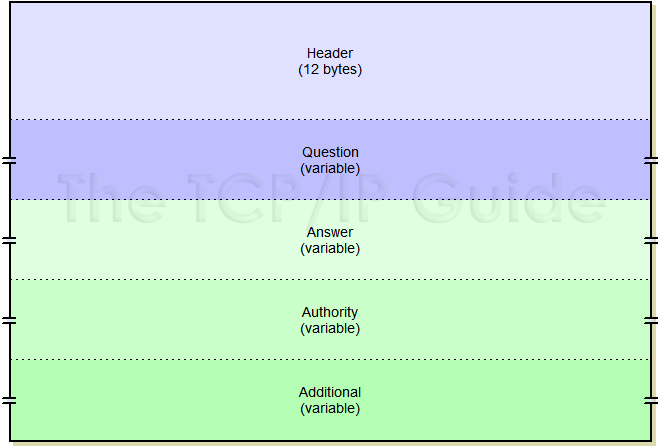
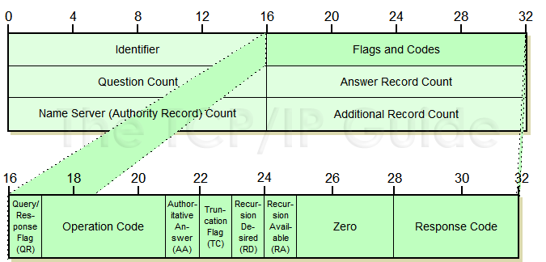
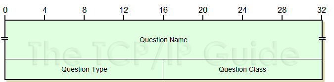
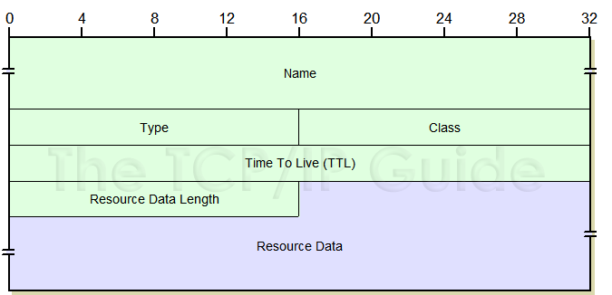

# DNS protocol

## Overview

**Working branch:** `feature/dns`

**Started date:** `13/07/2016`

**Deadline:** `18/07/2016`

**Developer:** @luongnv89

**Probe example**: extract file information such as: Transaction Id, ...

## List of tasks

* Study about protocol -> understand packet format specification

* Create data struct for extracting protocol attributes

* Implement parse DNS packet data

* Test DNS plugin

* Merge to `dev` branch

## DNS packets attributes

**DNS General Message Format**

**DNS Message Header Format**

| Attribute | MMT value | Value |data size| Notes |
| ------------ | ------------ | --- | --- | ---------------------- |
|DNS_ID|||2 bytes|Transaction ID|
|DNS_QR|MMT_DNS_UNKNOWN|0|1 bits|unknown type of DNS packet|
||MMT_DNS_QUERY|1|| DNS query packet|
||MMT_DNS_REPLY|2|| DNS reply packet|
|DNS_OPCODE|||4 bits|Operation code|
|||0||Operation code = QUERY - standard query|
|||1||Operation code - IQUERY - an inverse query (obsolete in RFC 1035)|
|||2||Operation code - STATUS - A server status request|
|||3||Operation code - (reserved) - Reserved, not used|
|||4||Operation code - NOTIFY - a special message type added by RFC 1996|
|||5||Operation code - UPDATE - a special message type added by RFC 2136|
|DNS_AA|||1 bit |Authoritative answer flag|
|||0|| the response is non-authoritative|
|||1|| the response is authoritative|
|DNS_TC||1 bit |Truncation Flag|
|||0|| the message was not truncated|
|||1|| the message was truncated (>512 bytes)|
|DNS_RD|||Recursion Desired - the value of this bit is not changed in the response|
|||0|| the server receiving the query does not attempt to answer the query recursively|
|||1|| the server receiving the query attempt to answer the query recursively (if server supports recursive resolution)|
|DNS_RA|||Recursion Available|
|||0|| the server creating the response does not support recursive queries|
|||1|| the server creating the response supports recursive queries|
|DNS_Z|||3 bits|Three reserved bits set to zero|
|DNS_RCODE|||4 bits|Response code, set 0 in queries|
|||0|| No Error - No error occurred|
|||1|| Format Error |
|||2|| Server Failure|
|||3|| Name Error|
|||4|| Not Impelemented|
|||5|| Refused|
|||6|| YX Domain|
|||7|| YX RR Set|
|||8|| NX RR Set|
|||9|| Not Auth|
|||10|| Not Zone|
|DNS_QDCOUNT|||2 bytes|question count - the number of questions in the question section of the message|
|DNS_ANCOUNT|||2 bytes|Answer record count - the number of resource records in the Answer session of the message|
|DNS_NSCOUNT|||2 bytes|Authority Record Count - the number of resource records in the Authority session of the message|
|DNS_ARCOUNT|||2 bytes|Additional Record count - the number of resource records in the additional session of the message|

**DNS Question Section Format**

| Attribute | MMT value | Value |data size| Notes |
| ------------ | ------------ | --- | --- | ---------------------- |
|DNS_QNAME|||String|Question Name: Contains the object, domain or zone name, encoded using [standard DNS name notation](http://www.tcpipguide.com/free/t_DNSNameNotationandMessageCompressionTechnique.htm)|
|DNS_QTYPE|||2 bytes|Question Type|
|||251||IXFR - A request for incremental (partial) zone transfer|
|||252||AXFR - A request for a zone transfer|
|||253||MAILB - A request for mailbox-related record|
|||254||MAILB - A request for mail agent resource records|
|||255||* - A request for all request|
|DNS_QCLASS|||2 bytes|Question class - the class of the resource record being requested (normaly 1 for Internet "IN", 255 - any class) [see more](http://www.tcpipguide.com/free/t_DNSNameServerDataStorageResourceRecordsandClasses.htm)|

**DNS Common resource Record Format**

| Attribute | MMT value | Value |data size| Notes |
| ------------ | ------------ | --- | --- | ---------------------- |
|NAME|||variable|Name - Contains the object, domain, ...|
|TYPE|||2 bytes| Type - Type a code value specifying the [type of resource record](http://www.tcpipguide.com/free/t_DNSNameServerDataStorageResourceRecordsandClasses-3.htm#Table_166)|
|Class|||2 bytes|Class - The [class](http://www.tcpipguide.com/free/t_DNSNameServerDataStorageResourceRecordsandClasses.htm) of the resource record being requested|
|TTL|||4 bytes|Time to Live - The number of seconds that the record should be retained in the cache|
|RDLength|||2 bytes|Resource Data Length - The size of RData field, in bytes|
|RData|||variable|Resource Data - The data portion of the resource record|

May need more detail:

* [RData Field Formats For Common Resource Records](http://www.tcpipguide.com/free/t_DNSMessageResourceRecordFieldFormats-3.htm)

* [DNS Start Of Authority Resource Record Data Format](http://www.tcpipguide.com/free/t_DNSMessageResourceRecordFieldFormats-4.htm)

* [Other DNS resource record](http://www.tcpipguide.com/free/t_DNSMessageResourceRecordFieldFormats-5.htm)

## DNS Name Notation and Message Compression Technique

More detail can be found from [here...](http://www.tcpipguide.com/free/t_DNSNameNotationandMessageCompressionTechnique.htm)

General rule: `[size_1]string_size_1[size_2]string_size_2[size_3]string_size_3[last_size=0]`

The string is separated by `.` or `@`

**Standard DNS Name Notation**

`www.xyzindustries.com` -> `[3] w w w [13] x y z i n d u s t r i e s [3] c o m [0]`

**DNS Electronic Mail Address Notation:** `[6] j o h n n y [9] s o m e w h e r e [3] o r g [0]`

**DNS Message Compression**: `[4] m a i l [13] x y z i n d u s t r i e s [3] c o m [0]`

>the second instance, where “mail.xyzindustries.com” shows up in the Name field of the A record, we would instead put two “1” bits, followed by the number 47 encoded in binary. So, this would be the 16-bit binary pattern “11000000 00101111”, or two numeric byte values “192” and “47”. This second instance now takes 2 bytes instead of duplicating the 24 bytes needed for the first instance of the name

**Using Message Compression to Avoid Duplication of Part of a Name**

`“[4] m a i l [pointer-to-byte-19]”.`

`“[pointer-to-byte-33]”`

## References

[RFC 1035 - DOMAIN NAMES - IMPLEMENTATION AND SPECIFICATION](https://www.ietf.org/rfc/rfc1035.txt)

[DNS Message Header and Question Section Format](http://www.tcpipguide.com/free/t_DNSMessageHeaderandQuestionSectionFormat.htm)

---
Created by @luongnv89 on 13 July 2017
