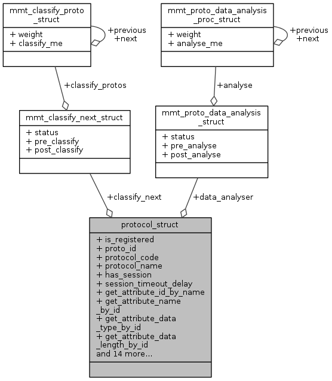

# MMT Protocol #

[TOC]

------------------



## Definition ##
**MMT Protocol** is a structure that represents overall context of a network protocol such as: Eth, IP, TCP, UDP, RTP, etc. It contains unique identifier for a protocol, session and attribute context and different utility function pointers.  Each network protocol needs to registered before being processed in `mmt-core`. 
## Protocol Internals ##
**Protocol internals** are the internal part which must not be changed while the protocol is being processed. They can be an attribute of protocol or a function pointer.
```c
    void * attributes_map; /**< For internal use. MUST not be changed. */
    void * attributes_names_map; /**< For internal use. MUST not be changed. */
    //void * sessions_map; /**< For internal use. MUST not be changed. */
    //void * classify_next; /**< For internal use. MUST not be changed. */
    mmt_classify_next_t classify_next; /**< For internal use. MUST not be changed. */
    void * sessionize; /**< For internal use. MUST not be changed. */
    void * session_data_init; /**< For internal use. Must not be chagned.*/
    //void * session_data_analysis; /**< For internal use. Must not be chagned.*/
    mmt_analyser_t data_analyser; /**< For internal use. Must not be chagned.*/
    void * session_data_cleanup; /**< For internal use. Must not be changed. */
    generic_comparison_fct session_key_compare; /**< Pointer to the session keys comparison function. Will exist if the proto has a session context. */
    void * session_context_cleanup; /**< For internal use. Must not be changed. */
    void * protocol_context_init; /**< For internal use. Must not be changed. */
    void * protocol_context_cleanup; /**< For internal use. Must not be changed. */
    void * protocol_context_args; /**< For internal use. Must not be changed. Pointer to the protocol's context argument.
                                   * Will be passed when calling protocol_context_init and protocol_context_cleanup. */
```
### Classification ###
Classify a protocol as a network protocol such as: IP, TCP, UDP, RTP,... according to the header and the attributes of protocol.
### Data analysis ###
Analysis the data
### Session management ###
Manage the session which belong to current packets.
### Session Data maintenance ###
Maintain the session data
### Context Data maintenance ###
Maintain the context data.
## API ##
### MMT Protocol struct
Each `MMT Protocol` has a unique `proto_id`, `protocol_code` and `protocol_name`. `MMT protocol` can belong to a session and can have several attributes which can be extracted by some pointer functions.
```c
/**
 * Defines a protocol structure.
 */
struct protocol_struct {
    int is_registered; /**< indicates if this protocol is registered or not */
    uint32_t proto_id; /**< unique identifier of the protocol. */
    int protocol_code; /**< Code of the protocol. Usually the same as the identifier. */
    const char * protocol_name; /**< The name of the protocol. Must be unique. */
    int has_session; /**< indicates if the protocol has a session context or not. */
    int session_timeout_delay; /**< indicates if the protocol has a session context or not. */
    generic_get_attribute_id_by_name get_attribute_id_by_name; /**< funtion pointer that returns the protocol's attribute id by name */
    generic_get_attribute_name_by_id get_attribute_name_by_id; /**< function pointer that returns the protocol's attribute name by id */
    generic_get_attribute_data_type_by_id get_attribute_data_type_by_id; /**< function pointer that returns the data type of an attribute */
    generic_get_attribute_data_length_by_id get_attribute_data_length_by_id; /**< function pointer that returns the data length of an attribute */
    generic_get_attribute_position_by_id get_attribute_position; /**< function pointer that returns the attribute position in the message */
    generic_is_valid_attribute is_valid_attribute; /**< function pointer that indicates if an attribute is valid for this protocol or not */
    generic_get_attribute_scope get_attribute_scope; /**< function pointer that indicates the scope of an attribute */
    generic_get_attribute_extraction_function get_attribute_extraction_function; /**< function pointer that indicates the extraction function to use for a given attribute of this protocol */

    void * attributes_map; /**< For internal use. MUST not be changed. */
    void * attributes_names_map; /**< For internal use. MUST not be changed. */
    mmt_classify_next_t classify_next; /**< For internal use. MUST not be changed. */
    void * sessionize; /**< For internal use. MUST not be changed. */
    void * session_data_init; /**< For internal use. Must not be chagned.*/
    mmt_analyser_t data_analyser; /**< For internal use. Must not be chagned.*/
    void * session_data_cleanup; /**< For internal use. Must not be changed. */
    generic_comparison_fct session_key_compare; /**< Pointer to the session keys comparison function. Will exist if the proto has a session context. */
    void * session_context_cleanup; /**< For internal use. Must not be changed. */
    void * protocol_context_init; /**< For internal use. Must not be changed. */
    void * protocol_context_cleanup; /**< For internal use. Must not be changed. */
    void * protocol_context_args; /**< For internal use. Must not be changed. Pointer to the protocol's context argument.
                                   * Will be passed when calling protocol_context_init and protocol_context_cleanup. */
};
```
### User API ###

```c
MMTAPI protocol_t* MMTCALL get_protocol_struct_by_id(
    uint32_t proto_id
);
```
Get the protocol structure by given `proto_id`. This function MUST only be used when we are sure that there is a protocol structure associated with the given identifier. If there is no protocol associated with the given identifier, null will be returned. This function is to be used with high precautions.
```c
MMTAPI int MMTCALL get_proto_attribute_position(
    protocol_t *proto,
    uint32_t proto_id,
    uint32_t attr_id
);

MMTAPI int MMTCALL get_proto_attribute_length(
    protocol_t *proto,
    uint32_t proto_id,
    uint32_t attr_id
);

MMTAPI int MMTCALL get_proto_attribute_id(
    protocol_t *proto,
    uint32_t proto_id,
    const char *attr_name
);

MMTAPI const char* MMTCALL get_proto_attribute_name(
    protocol_t *proto,
    uint32_t proto_id,
    uint32_t attr_id
);

MMTAPI int MMTCALL get_proto_attribute_type(
    protocol_t *proto,
    uint32_t proto_id,
    uint32_t attr_id
);

MMTAPI int MMTCALL get_proto_attribute_scope(
    protocol_t *proto,
    uint32_t proto_id,
    uint32_t attr_id
);

MMTAPI int MMTCALL is_valid_proto_attribute(
    protocol_t *proto,
    uint32_t proto_id,
    uint32_t attr_id
);
```
These APIs extract different metadatas associated with protocol attributes with the help of given `protocol structure`, `proto_id`,`attr_name` and `attribute id`.

### Developer API
```c
MMTAPI int MMTCALL set_classified_proto(
    ipacket_t *ipacket,
    unsigned index,
    classified_proto_t classified_proto
);
```
Set classified protocol for a packet.
```c
MMTAPI int MMTCALL register_classification_function_with_parent_protocol(
    uint32_t proto_id,
    generic_classification_function classification_fct,
    int weight
);
```
This function registers a classification function for the protocol identified by the given proto_id. This function should be used when a protocol wants to complement the classification of another protocol (HTTP adding a classification to TCP). For protocols registering their own classification function, this function SHOULD BE AVOIDED, rather use "register_classification_function".

```c
MMTAPI int MMTCALL register_classification_function(
    protocol_t *protocol_struct,
    generic_classification_function classification_fct
);
```
This function registers a classification function for the protocol identified by the given protocol_struct. This function MUST only be used when a protocol registers its own classification function. This function will always perform what it is supposed to do.

```c
MMTAPI int MMTCALL register_classification_function_full(
    protocol_t *protocol_struct,
    generic_classification_function classification_fct,
    int weight,
    generic_classification_function pre_classification,
    generic_classification_function post_classification
);
```
This function registers a classification function, a pre-classification and a post-classification for the protocol identified by the given protocol_struct. This function MUST only be used when a protocol registers its own classification function. This function will always perform what it is supposed to do.

```c
MMTAPI int MMTCALL register_pre_post_classification_functions(
    protocol_t *protocol_struct,
    generic_classification_function pre_classification,
    generic_classification_function post_classification
);
``` 
This function registers a pre and post classification functions for the protocol identified by the given protocol_struct. This function MUST only be used when a protocol registers its own classification function. This function will always perform what it is supposed to do.

```c
MMTAPI void MMTCALL register_sessionizer_function(
    protocol_t *protocol_struct,
    generic_sessionizer_function sessionizer_fct,
    generic_session_context_cleanup_function session_context_cleanup_fct,
    generic_comparison_fct session_keys_comparison_fct
);
```
This function registers a sessionizer function along with the session context cleanup function for the protocol identified by the given protocol_struct.

```c
MMTAPI void MMTCALL register_proto_context_init_cleanup_function(
    protocol_t *protocol_struct,
    generic_proto_context_init_function context_init_fct,
    generic_proto_context_cleanup_function context_cleanup_fct,
    void *args
);
```
This function registers a protocol context cleanup function for the protocol identified by the given protocol_struct.

```c
MMTAPI void MMTCALL register_session_data_initialization_function(
    protocol_t *protocol_struct,
    generic_session_data_initialization_function session_data_init_fct
);
```
This function registers the given session data initialization function with the given protocol structure

```c
MMTAPI void MMTCALL register_session_data_cleanup_function(
    protocol_t *protocol_struct,
    generic_session_data_cleanup_function session_data_cleanup_fct
);
```
This function registers the given session data cleanup function with the given protocol structure.

```c
MMTAPI int MMTCALL register_session_data_analysis_function_with_protocol(
    uint32_t proto_id,
    generic_session_data_analysis_function session_data_analysis_fct,
    int weight
);
```
This function registers a session data analysis function for the protocol identified by the given proto_id. This function should be used in order to complement the analysis of a protocol. For protocols registering their own analysis function, this function SHOULD BE AVOIDED, rather use "register_session_data_analysis_function".

```c
MMTAPI int MMTCALL register_session_data_analysis_function(
    protocol_t *protocol_struct,
    generic_session_data_analysis_function session_data_analysis_fct
);
```
This function registers a session data analysis function for the protocol identified by the given protocol_struct. This function MUST only be used when a protocol registers its own session data analysis function. This function will always perform what it is supposed to do.

```c
MMTAPI int MMTCALL register_session_data_analysis_function_full(
    protocol_t *protocol_struct,
    generic_session_data_analysis_function session_data_analysis_fct,
    int weight,
    generic_session_data_analysis_function pre_analysis,
    generic_session_data_analysis_function post_analysis
);
```
This function registers a session data analysis function for the protocol identified by the given protocol_struct. This function MUST only be used when a protocol registers its own session data analysis function. This function will always perform what it is supposed to do.

```c
MMTAPI int MMTCALL register_pre_post_analysis_functions(
    protocol_t *protocol_struct,
    generic_session_data_analysis_function pre_analysis,
    generic_session_data_analysis_function post_analysis
);
```
This function registers a pre and post analysis functions for the protocol identified by the given protocol_struct. This function MUST only be used when a protocol registers its own analysis function. This function will always perform what it is supposed to do.
```c
MMTAPI int MMTCALL is_free_protocol_id_for_registraction(
    uint32_t proto_id
);
```
This function returns a positive value if their is no protocol registered with the given identifier. NULL otherwise.
```c
MMTAPI protocol_t* MMTCALL get_protocol_struct_for_registration_if_free(
    uint32_t proto_id
);
```
This function returns a pointer to the protocol structure if the given identifier is not registered, NULL otherwise.
```c
MMTAPI protocol_t* MMTCALL init_protocol_struct_for_registration(
    uint32_t proto_id,
    const char *protocol_name
);
```
This function returns a pointer to the protocol if the given identifier is not registered, NULL otherwise.

```c
MMTAPI int MMTCALL register_attribute_with_protocol(
    protocol_t *protocol_struct,
    attribute_metadata_t *attribute_meta_data
);
```
This function registers an attribute given by its metadata structure with the given protocol. The registration succeeds if the attribute metadata is valid and the attribute is not already registered, it fails otherwise.

```c
MMTAPI int MMTCALL register_protocol(
    protocol_t *protocol_struct,
    uint32_t proto_id
);
```
This function registers the protocol defined by the given protocol structure and protocol identifier.
## Open Issues ##