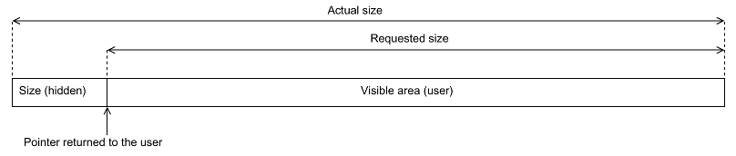

# Memory Management #

[TOC]

------------------

This is an overview of the memory management features implemented in [memory.c](/montimage/mmt/src/mmt_core/src/memory.c).

## Scope ##

* Monitor global memory usage for `mmt_core` and `mmt_tcpip`,
* Provide some statistics on memory allocation,
* Provide a general-purpose listener/observer mechanism so that specific action can be taken on user-defined conditions
  (e.g.: threshold on memory usage, etc..)

## Implementation ##

Each chunk of allocated memory is prefixed with the size of the chunk.
Global counters on allocated and freed memory are also maintained;  those counters are accessible through `mmt_meminfo()`.

## Basic Usage ##

Just use `mmt_malloc()`, `mmt_realloc()` and `mmt_free()` instead of `malloc()`, `realloc()` and `free()`, respectively.

The memory allocator does the housekeeping in a (hopefully) transparent way.

'''Don't check for allocation errors''', this is useless most of the time (see the following section).  Just assume that memory allocation was successful.

## Failure Management ##

The general rule is that any failed attempt to allocate memory should result in a call to `libc::abort()`.

Recovery attempts are useless (unless part of a well-designed fail-safe architecture).

There are several reasons for this:

* Error conditions on memory allocation are typically very poorly handled (if handled at all), everybody gets lazy and forgets to check for NULL pointers at some point,
* A supervised crash is always better than a dangling NULL pointer silently propagating through the code (that will eventually end up in a crash anyway, or worse: an incorrect result),
* Even when properly handled, error conditions on memory allocation complicate the code considerably,
* There are clear indicators that memory shortage is about to occur: by the time the kernel is actually unable to allocate memory, the system will be paging like crazy and performances will have long dropped (so the software won't be usable anyway),
* Allocation failures often occur in the deepest parts of the code (low-level functions, such as lists of hash element allocation), in contrast, memory sizing is really a high-level (integration) issue.  When facing memory shortage issues, the correct course of action is not to try to have some clumsy/obscure indicators (NULL pointers) resurface from the depths of the code, the correct course of action is to buy more RAM ! :-)

On modern operating systems, with huge amounts of RAM and swap space, a virtually unlimited amount of memory should be assumed.

Let's concentrate on CPU usage instead, and remember:  **free the mallocs** ;-)