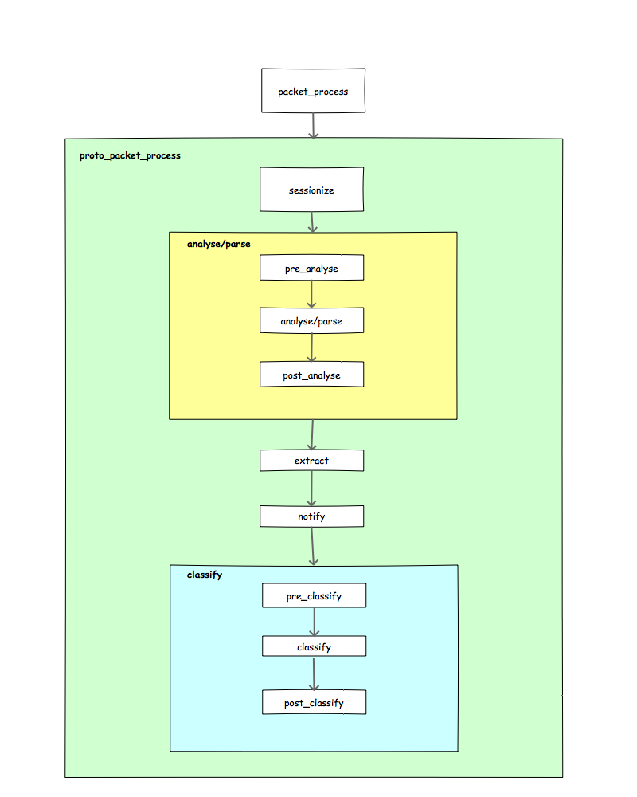

# packet journey #

[TOC]

------------------

## Objectives ##
 * Avoid unnecessary loops
 * Provide an intuitive and harmonized processing
 * Provide elegant and simple implementation of `exit actions`
 * Flexible for user additions (either through protocol plugins, or through the public API)

## Proposed work flow ##
 * `packet_process`: This is the entry point for processing packets of any type. This is part of the public API.
 * `proto_packet_process`: this will be called for every protocol in the path starting by META protocol (will always be called first).
    * `sessionize`: responsible for grouping packets into sessions. This is protocol specific. Not every protocol implements sessions.
    * `analyse/parse`: responsible for parsing the packet and maintaining (if specified by the protocol) the session context. This block is protocol specific.
        * `pre_analyse`: to ensure that the necessary conditions are met to analyse/parse the packet. At this point we will be able to catch malformed and truncated, etc. packets and define exit actions.
        * `analyse/parse`: this is where the analysis routines are called according to their weights. User defined analysis can be inserted (API will be provided for this) in order to extend the analysis.
        * `post_analyse`
    * `extract`: This is where the actual attributes extraction is done. Extraction should be extended to support:
        * **Event based extraction**: where the attribute is extracted and then notified (if a callback is registered with it) while parsing the packet.
       This is particularly interesting when the attribute is repeated in the packet, when the extraction requires parsing (XML),
       when the attribute is optional in the packet (don't try to look for in every packet, instead, get notified when it is detected), etc.
        * **Request based extraction**: where the attribute is extracted upon request. This is particularly interesting for packet attributes in binary protocols (IP addresses, port numbers, etc.).
    * `notify`: this sub-process depends on the extraction strategy. It might be called directly within the extract sub-process in the case of event based attributes.
        * At this point the user should be able to provide `target actions` (check iptables & netfiler for references) to indicate if the processing of the packet should:
            * `continue`
            * `stopped`: stop processing at this level and return from `packet_process`
            * `break`: continue the processing with this protocol but no further (do not go into `classify_next` sub-process)
            * TBD
    * `classify_next`: this sub-process is in its turn divided into
        * `pre_classify`: to ensure that the necessary conditions and status updates are met for the classification process to be started. For TCP packet, the packet status will change to `MMT_SKIP`(to avoid calling `proto_packet_process`) and wait until it is ordered in right order then the `proto_packet_process` will be called.
        * `classify`: this is where the classification routines are called according to their weights. User defined classification can be inserted
       (API provided for this) in order to extend the classification.
        * `post_classification`: updates the status information for the next protocols according to the result of the classification
    * `proto_packet_process`: called again if the classification sub-process returned a known protocol and the packet status is `MMT_CONTINUE`.

## Target Actions ##
 * `MMT_CONTINUE`: indicates that the packet processing can continue normally
 * `MMT_SKIP`: indicates that the processing with the current protocol can continue but not further (skip further protocols)
 * `MMT_DROP`: indicates that the processing of the current packets should be interrupted
