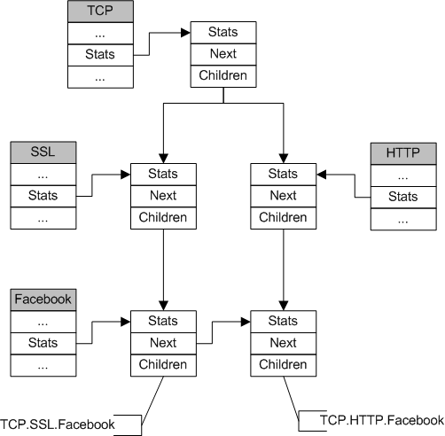

# Protocol Statistics #

[TOC]

------------------

## Definition ##

It is a structure maintained by every protocol instance of an MMT handler to record the statistics of the protocol.
The protocol statistics are updated within MMT core and provides a harmonized way to access these statistics. Whatever the protocol is, the access to its statistics is the same.

## Protocol Statistics Internals ##

### Implementation ###

Protocol statistics have:

* **Tree structure**: to link statistics of a parent protocol to its children protocols (TCP with SSL and HTTP in the figure).
* **List structure**: to link the different statistics instances of a given protocol (Facebook in the figure).

As an application/protocol can appear in different protocol paths (facebook above SSL and HTTP), there will be one statistics instance per protocol path.
In the following figure, Facebook has two statistics instances; one for path TCP.SSL.Facebook and one for path TCP.HTTP.Facebook.



## API ##

### Common Attributes ###

MMT provides a set of attributes (common to all protocols) to access the protocol statistics:

* `PROTO_PACKET_COUNT` OR "packet_count"
* `PROTO_DATA_VOLUME` OR "data_count"
* `PROTO_PAYLOAD_VOLUME` OR "payload_count"
* `PROTO_SESSIONS_COUNT` OR "session_count"
* `PROTO_ACTIVE_SESSIONS_COUNT` OR "a_session_count"
* `PROTO_TIMEDOUT_SESSIONS_COUNT` OR "t_session_count"
* `PROTO_STATISTICS` OR "stats"

### User API ###

```c
   proto_statistics_t * get_protocol_stats(mmt_handler_t *mmt_handler, uint32_t proto_id);
```

   Returns a pointer to the protocol statistics (list) of the given protocol.

```c
   void get_protocol_stats_path(mmt_handler_t *mmt_handler, proto_statistics_t *stats, proto_hierarchy_t *proto_hierarchy);
```

   Provides the protocol path of the given statistics instance.

```c
   void get_children_stats(proto_statistics_t * parent_stats, proto_statistics_t * children_stats);
```

   Provides the aggregation of the children protocol statistics.

```c
   void reset_statistics(proto_statistics_t * stats);
```

   Resets the given protocol statistics instance.

```c
   void enable_protocol_statistics(mmt_handler_t *mmt_handler);

   void disable_protocol_statistics(mmt_handler_t *mmt_handler);
```

   Enables/Disables the statistics maintenance for the protocol of the given MMT Handler.

## Open Issues ##
