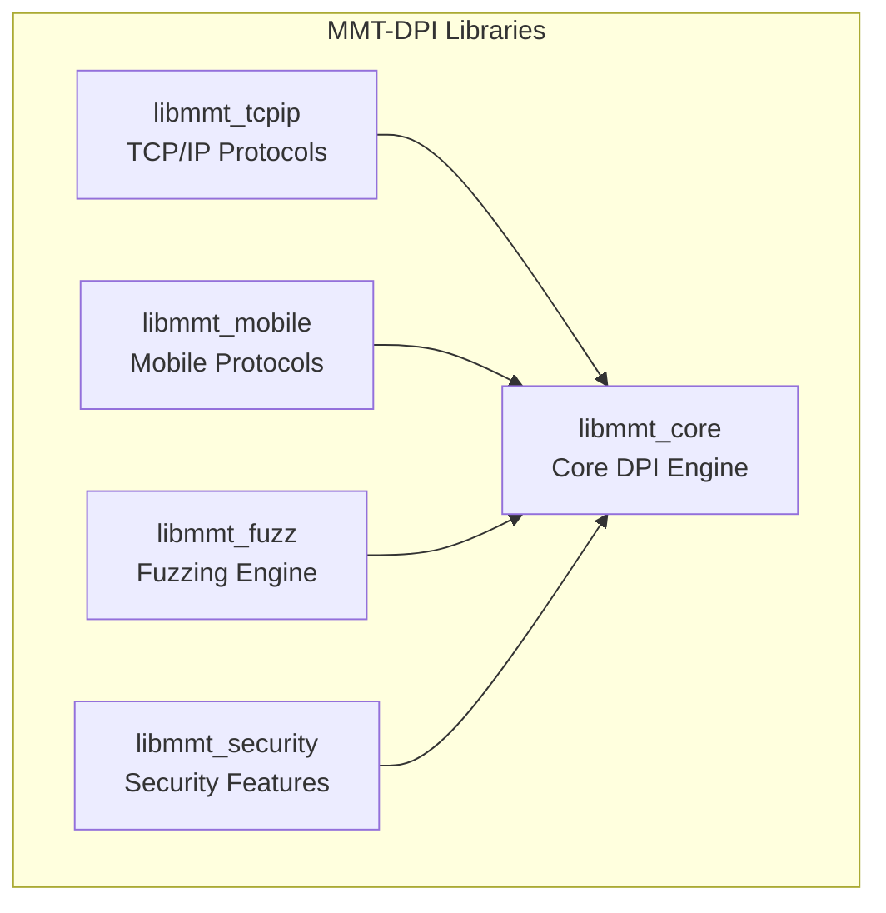

# MMT-DPI Documentation

**Montimage Deep Packet Inspection Library** - A high-performance C library for real-time network traffic analysis supporting 200+ protocols.

## Quick Navigation

| Section | Description |
|---------|-------------|
| [Quick Start](#quick-start) | Get running in 5 minutes |
| [Architecture](architecture/README.md) | System design and components |
| [API Reference](api-reference/README.md) | Complete API documentation |
| [Guides](guides/README.md) | Installation, development, deployment |
| [Protocols](protocols/README.md) | Supported protocols and extensions |
| [Troubleshooting](troubleshooting/README.md) | Common issues and solutions |

---

## Quick Start

### Prerequisites

- GCC or Clang compiler
- GNU Make
- libpcap-dev
- libxml2-dev

### Build

```bash
git clone https://github.com/Montimage/mmt-dpi.git
cd mmt-dpi/sdk
make -j$(nproc)
```

### Verify

```bash
ls -la sdk/lib/libmmt_core.so
ls -la sdk/lib/libmmt_tcpip.so
```

### Basic Usage

```c
#include "mmt_core.h"
#include "tcpip/mmt_tcpip.h"

int main() {
    // Initialize handler for Ethernet packets
    mmt_handler_t *handler = mmt_init_handler(DLT_EN10MB, 0, NULL);

    // Register TCP/IP protocols
    init_proto_tcpip_struct();

    // Process packets...
    // mmt_process_packet(handler, &header, packet_data);

    // Cleanup
    mmt_close_handler(handler);
    return 0;
}
```

---

## Library Components



| Library | Description | Protocols |
|---------|-------------|-----------|
| **libmmt_core** | Core DPI engine | Packet processing, sessions, memory pool |
| **libmmt_tcpip** | TCP/IP stack | HTTP, DNS, TCP, UDP, SSL/TLS, FTP, SSH, 50+ more |
| **libmmt_mobile** | Mobile networks | GTP, S1AP, NGAP, NAS (LTE/5G) |
| **libmmt_fuzz** | Fuzzing | Protocol fuzzing infrastructure |
| **libmmt_security** | Security | Attack detection, security events |

---

## Key Features

- **200+ Protocol Handlers** - Deep inspection from Layer 2 to Layer 7
- **High Performance** - Optimized hash tables (4096 slots), memory pools (O(1) allocation)
- **Thread-Safe** - Fine-grained locking, lock-free hot paths
- **Security Hardened** - 117+ vulnerabilities fixed, bounds checking throughout
- **Extensible** - Plugin system for custom protocols

---

## Documentation Structure

```
new-docs/
├── README.md                    # This file
├── architecture/
│   ├── README.md               # Architecture overview
│   ├── core-engine.md          # Core DPI engine design
│   ├── protocol-stack.md       # Protocol layering
│   └── data-flow.md            # Packet processing flow
├── api-reference/
│   ├── README.md               # API overview
│   ├── core-api.md             # mmt_core functions
│   ├── error-handling.md       # Error codes and handling
│   ├── logging.md              # Logging system
│   └── validation.md           # Input validation macros
├── guides/
│   ├── README.md               # Guides index
│   ├── installation.md         # Build and install (all platforms)
│   ├── development.md          # Development workflow
│   ├── adding-protocols.md     # Creating new protocol handlers
│   └── deployment.md           # Production deployment
├── protocols/
│   ├── README.md               # Protocol index
│   ├── tcp-ip/                 # TCP/IP protocol docs
│   └── mobile/                 # Mobile protocol docs
├── troubleshooting/
│   └── README.md               # Common issues and solutions
└── development/
    └── README.md               # Internal development docs
```

---

## Version Information

- **Current Version:** 1.7.10
- **API Stability:** Stable (no ABI breaking changes)
- **Platforms:** Linux, macOS, Windows (cross-compile)

---

## Links

- **Source Code:** [GitHub - Montimage/mmt-dpi](https://github.com/Montimage/mmt-dpi)
- **Website:** [montimage.com](http://www.montimage.com)
- **Issues:** [GitHub Issues](https://github.com/Montimage/mmt-dpi/issues)
- **Contact:** contact@montimage.com

---

## License

See [LICENSE](../LICENSE) file for details.
