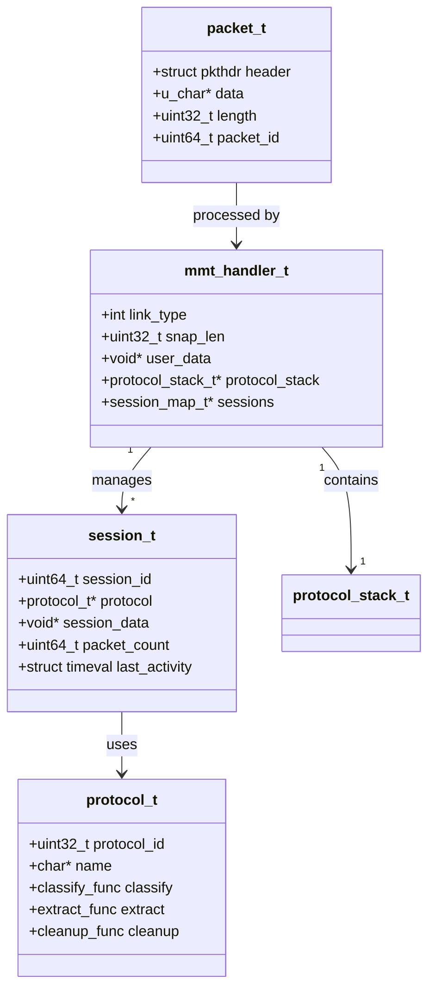
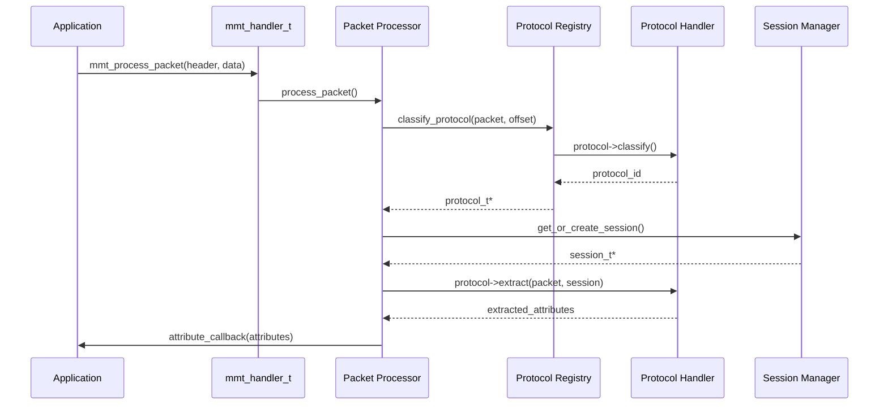
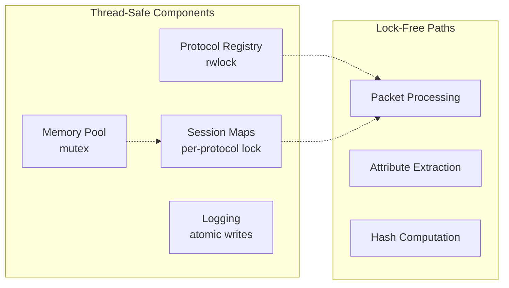

# Core Engine Architecture

The core engine (`libmmt_core`) provides the foundational packet processing infrastructure.

## Component Overview



## Source Files

| File | Purpose | Lines |
|------|---------|-------|
| `packet_processing.c` | Main packet processing engine | ~5000 |
| `plugins_engine.c` | Protocol plugin management | ~800 |
| `hashmap.c` | Session hash table | ~400 |
| `mempool.c` | Memory pool allocator | ~300 |
| `mmt_errors.c` | Error handling framework | ~400 |
| `mmt_logging.c` | Logging system | ~300 |

## Packet Processing Pipeline



## Key Design Decisions

### 1. Protocol Registry with Read-Write Locks

Protocols are registered at initialization and rarely modified. Using read-write locks allows:
- Multiple threads to read protocol definitions simultaneously
- Safe protocol registration during runtime (rare)

### 2. Session Map with Per-Protocol Locks

Each protocol maintains its own session map with dedicated locks:
- Reduces lock contention between protocols
- Allows parallel processing of different protocol types

### 3. Memory Pool for Session Allocation

Sessions are frequently created/destroyed. The memory pool:
- Pre-allocates session memory blocks
- Provides O(1) allocation and deallocation
- Reduces fragmentation

### 4. Hash Table Optimization

Session lookup uses optimized hash tables:
- 4096 slots (power of 2 for bitmask hashing)
- Bitmask instead of modulo (10-40x faster)
- ~0.4% collision rate (down from ~6%)

## Thread Safety Model



## Error Handling Architecture

The error framework provides structured error reporting:

```c
// Error codes organized by category (1000+ codes)
MMT_ERROR_NONE           = 0
MMT_ERROR_MEMORY         = 1001-1099
MMT_ERROR_PACKET         = 2001-2099
MMT_ERROR_PROTOCOL       = 3001-3099
MMT_ERROR_SESSION        = 4001-4099
```

See [Error Handling](../api-reference/error-handling.md) for details.
