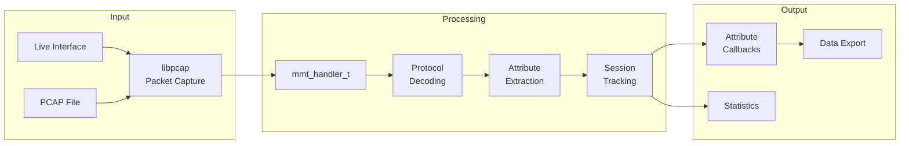
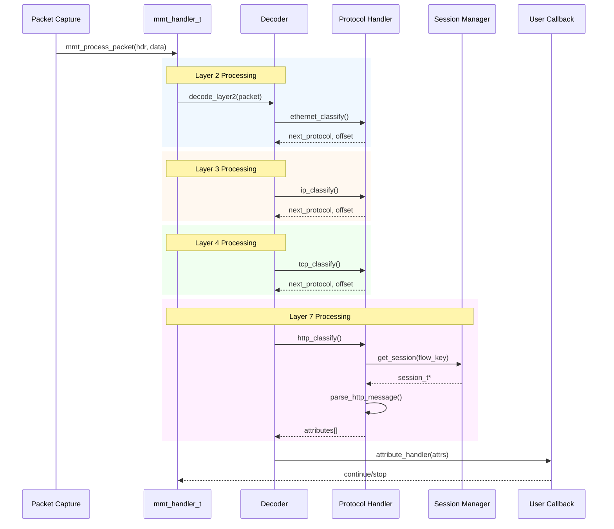
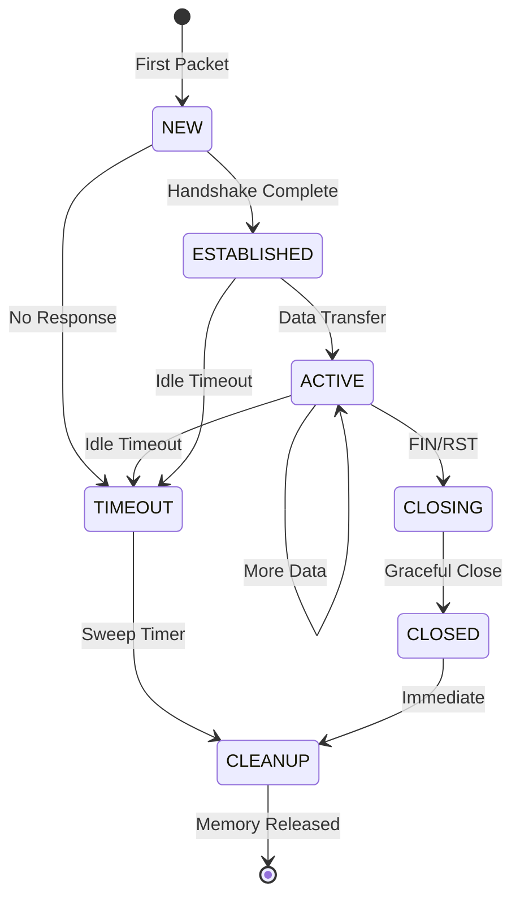
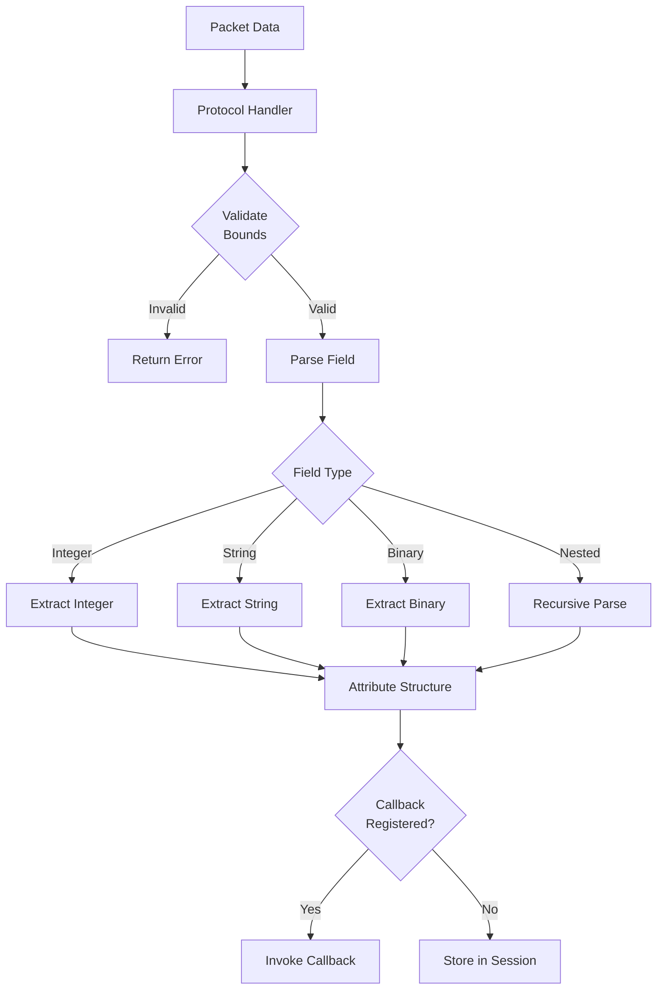
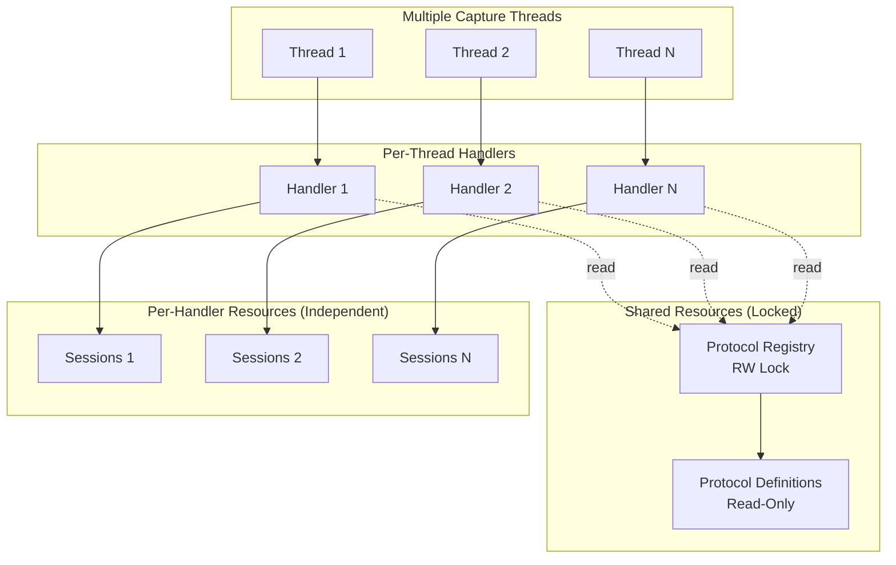

# Data Flow Architecture

This document describes how packets flow through the MMT-DPI processing pipeline.

## High-Level Data Flow



## Detailed Processing Flow



## Memory Flow

```mermaid
flowchart TB
    subgraph "Memory Allocation"
        POOL[Memory Pool<br/>Pre-allocated blocks]
        HEAP[Heap<br/>Large allocations]
    end

    subgraph "Session Lifecycle"
        NEW[New Session]
        ACTIVE[Active Session]
        TIMEOUT[Timeout Check]
        CLEANUP[Cleanup]
    end

    subgraph "Packet Processing"
        PKT[Packet Buffer]
        ATTR[Attribute Buffer]
        TEMP[Temp Allocations]
    end

    POOL -->|O(1) alloc| NEW
    NEW --> ACTIVE
    ACTIVE -->|packet arrives| ACTIVE
    ACTIVE -->|no activity| TIMEOUT
    TIMEOUT -->|expired| CLEANUP
    CLEANUP -->|return to pool| POOL

    PKT -->|stack allocated| ATTR
    HEAP -->|large data| ATTR
    TEMP -->|freed per packet| TEMP
```

## Session State Machine



## Attribute Extraction Flow



## Concurrency Model



## Performance Characteristics

| Operation | Complexity | Notes |
|-----------|------------|-------|
| Session lookup | O(1) average | Hash table with 4096 slots |
| Session creation | O(1) | Memory pool allocation |
| Protocol classification | O(L) | L = number of layers |
| Attribute extraction | O(A) | A = number of attributes |
| Callback invocation | O(C) | C = registered callbacks |
