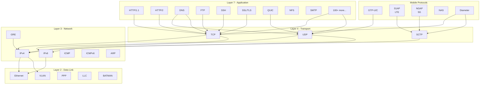
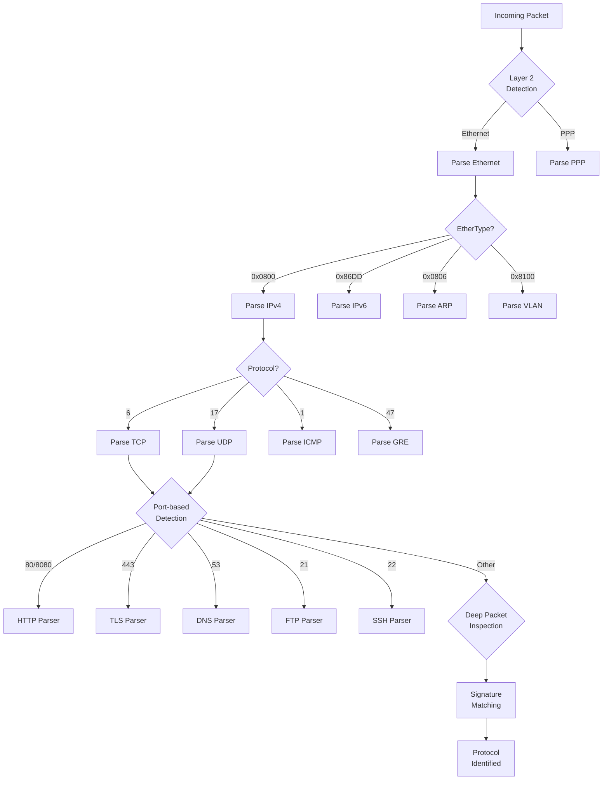

# Protocol Stack Architecture

MMT-DPI supports 200+ protocols organized in a layered hierarchy.

## Protocol Layers



## Protocol Classification Flow



## Protocol Handler Structure

Each protocol handler implements:

```c
typedef struct protocol_t {
    uint32_t protocol_id;           // Unique protocol identifier
    const char *name;               // Human-readable name

    // Classification function
    int (*classify)(ipacket_t *packet, unsigned offset,
                    unsigned header_len);

    // Attribute extraction function
    int (*extract)(const ipacket_t *packet, unsigned offset,
                   attribute_t *attribute);

    // Session initialization
    void* (*session_init)(void);

    // Session cleanup
    void (*session_cleanup)(void *session_data);

    // Protocol-specific attributes
    attribute_metadata_t *attributes;
    int attribute_count;
} protocol_t;
```

## Protocol Libraries

### libmmt_tcpip

Location: `src/mmt_tcpip/lib/protocols/`

| Category | Protocols |
|----------|-----------|
| **Core** | Ethernet, IP, IPv6, TCP, UDP, ICMP |
| **Web** | HTTP, HTTP/2, SSL/TLS, QUIC |
| **Email** | SMTP, POP3, IMAP |
| **File Transfer** | FTP, TFTP, NFS |
| **Name Services** | DNS, mDNS, LLMNR |
| **Remote Access** | SSH, Telnet, RDP |
| **Tunneling** | GRE, VXLAN, MPLS, GTP |
| **Routing** | OSPF, BGP, RIP |
| **Streaming** | RTSP, RTP, RTCP |

### libmmt_mobile

Location: `src/mmt_mobile/`

| Protocol | Standard | Purpose |
|----------|----------|---------|
| **GTP** | 3GPP | GPRS Tunneling Protocol |
| **S1AP** | 3GPP | LTE signaling (eNB to MME) |
| **NGAP** | 3GPP | 5G signaling (gNB to AMF) |
| **NAS** | 3GPP | Non-Access Stratum messaging |
| **Diameter** | IETF | AAA signaling |

## Adding New Protocols

See [Adding Protocols Guide](../guides/adding-protocols.md) for step-by-step instructions.
