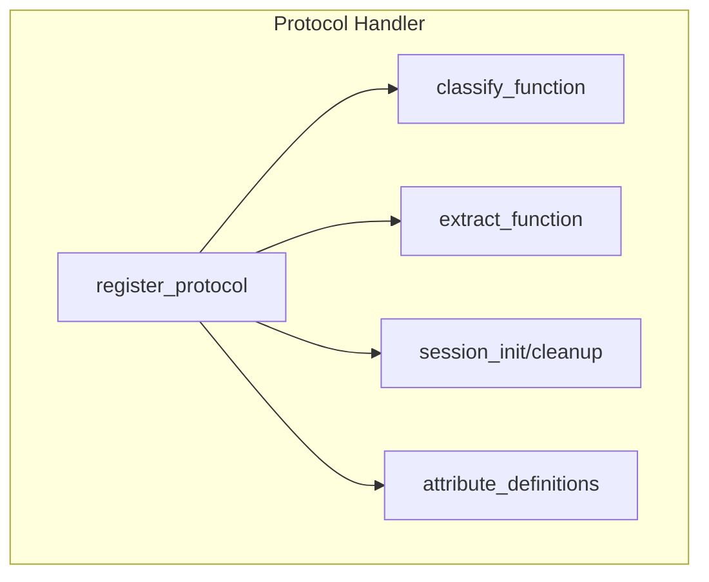

# Adding Protocol Handlers

Guide for implementing new protocol handlers in MMT-DPI.

## Overview

Protocol handlers in MMT-DPI:
1. Classify packets to identify the protocol
2. Extract attributes from the protocol header/payload
3. Manage protocol-specific session state

## Protocol Handler Structure



## Step-by-Step Guide

### Step 1: Create Header File

Create `src/mmt_tcpip/lib/protocols/myproto.h`:

```c
#ifndef MMT_MYPROTO_H
#define MMT_MYPROTO_H

#include "mmt_core.h"

// Protocol ID (choose unique ID)
#define PROTO_MYPROTO 1234

// Attribute IDs
#define MYPROTO_FIELD1    1
#define MYPROTO_FIELD2    2
#define MYPROTO_FIELD3    3

// Protocol header structure (packed)
typedef struct myproto_header_struct {
    uint8_t  version;
    uint8_t  type;
    uint16_t length;
    uint32_t session_id;
} __attribute__((packed)) myproto_header_t;

// Initialization function
int init_myproto_proto_struct(void);

#endif // MMT_MYPROTO_H
```

### Step 2: Create Implementation File

Create `src/mmt_tcpip/lib/protocols/myproto.c`:

```c
#include "myproto.h"
#include "mmt_protocol_validation.h"
#include "mmt_errors.h"
#include "mmt_logging.h"

// Minimum header size
#define MYPROTO_MIN_HEADER_SIZE sizeof(myproto_header_t)

/**
 * Classify function - called to identify protocol
 */
static int myproto_classify(const ipacket_t *packet, unsigned offset)
{
    // Validate we have minimum header
    if (packet->len < offset + MYPROTO_MIN_HEADER_SIZE) {
        return 0;  // Not enough data
    }

    // Get header pointer
    const myproto_header_t *hdr =
        (const myproto_header_t *)(packet->data + offset);

    // Check protocol signature/magic
    if (hdr->version != 1) {
        return 0;  // Not our protocol
    }

    // Return payload offset (header length)
    return MYPROTO_MIN_HEADER_SIZE;
}

/**
 * Extract field1 attribute
 */
static int extract_field1(const ipacket_t *packet, unsigned offset,
                          attribute_t *attr)
{
    const myproto_header_t *hdr;
    MMT_GET_HEADER_PTR(packet, offset, myproto_header_t, hdr, PROTO_MYPROTO);

    attr->data = (void *)&hdr->type;
    attr->data_len = sizeof(uint8_t);

    return MMT_ERROR_NONE;
}

/**
 * Extract field2 attribute
 */
static int extract_field2(const ipacket_t *packet, unsigned offset,
                          attribute_t *attr)
{
    const myproto_header_t *hdr;
    MMT_GET_HEADER_PTR(packet, offset, myproto_header_t, hdr, PROTO_MYPROTO);

    // Convert to host byte order
    static uint16_t length;
    length = ntohs(hdr->length);

    attr->data = &length;
    attr->data_len = sizeof(uint16_t);

    return MMT_ERROR_NONE;
}

/**
 * Attribute definitions
 */
static attribute_metadata_t myproto_attributes[] = {
    {
        .id = MYPROTO_FIELD1,
        .alias = "type",
        .data_type = MMT_DATA_TYPE_U8,
        .extract = extract_field1
    },
    {
        .id = MYPROTO_FIELD2,
        .alias = "length",
        .data_type = MMT_DATA_TYPE_U16,
        .extract = extract_field2
    },
    // Add more attributes...
};

#define MYPROTO_ATTR_COUNT \
    (sizeof(myproto_attributes) / sizeof(attribute_metadata_t))

/**
 * Protocol definition
 */
static protocol_t myproto_protocol = {
    .protocol_id = PROTO_MYPROTO,
    .name = "myproto",
    .classify = myproto_classify,
    .attributes = myproto_attributes,
    .attribute_count = MYPROTO_ATTR_COUNT,
};

/**
 * Initialize and register protocol
 */
int init_myproto_proto_struct(void)
{
    int ret = register_protocol(&myproto_protocol, PROTO_MYPROTO);
    if (ret != 0) {
        MMT_LOG_ERROR("Failed to register myproto protocol");
        return ret;
    }

    MMT_LOG_INFO("Registered myproto protocol (ID: %d)", PROTO_MYPROTO);
    return 0;
}
```

### Step 3: Add to Build System

Edit `src/mmt_tcpip/Makefile` to include the new file:

```makefile
SRCS += lib/protocols/myproto.c
```

### Step 4: Register in Protocol Initialization

Edit `src/mmt_tcpip/include/tcpip/mmt_tcpip.h`:

```c
// Add declaration
int init_myproto_proto_struct(void);
```

Edit `src/mmt_tcpip/lib/mmt_tcpip.c`:

```c
int init_proto_tcpip_struct(void) {
    // ... existing protocols ...

    // Add myproto initialization
    init_myproto_proto_struct();

    return 0;
}
```

### Step 5: Add Tests

Create `test/unit/test_myproto.c`:

```c
#include <stdio.h>
#include <assert.h>
#include "mmt_core.h"
#include "tcpip/mmt_tcpip.h"
#include "myproto.h"

static int test_myproto_classify(void) {
    // Create test packet
    uint8_t packet_data[] = {
        0x01,       // version = 1
        0x02,       // type = 2
        0x00, 0x10, // length = 16 (network order)
        0x00, 0x00, 0x00, 0x01  // session_id = 1
    };

    // Create mock ipacket
    ipacket_t packet = {
        .data = packet_data,
        .len = sizeof(packet_data)
    };

    // Test classification
    int result = myproto_classify(&packet, 0);
    assert(result == sizeof(myproto_header_t));

    printf("test_myproto_classify: PASSED\n");
    return 0;
}

int main(void) {
    init_proto_tcpip_struct();

    int failed = 0;
    failed += test_myproto_classify();

    return failed;
}
```

## Protocol with Session State

For protocols that require session tracking:

```c
// Session data structure
typedef struct myproto_session {
    uint32_t session_id;
    uint32_t packet_count;
    // ... more state ...
} myproto_session_t;

/**
 * Initialize session data
 */
static void *myproto_session_init(void)
{
    myproto_session_t *session = calloc(1, sizeof(myproto_session_t));
    return session;
}

/**
 * Cleanup session data
 */
static void myproto_session_cleanup(void *session_data)
{
    free(session_data);
}

// Add to protocol definition
static protocol_t myproto_protocol = {
    .protocol_id = PROTO_MYPROTO,
    .name = "myproto",
    .classify = myproto_classify,
    .session_init = myproto_session_init,
    .session_cleanup = myproto_session_cleanup,
    .attributes = myproto_attributes,
    .attribute_count = MYPROTO_ATTR_COUNT,
};
```

## Encapsulated Protocols

For protocols that encapsulate other protocols:

```c
static int myproto_classify(const ipacket_t *packet, unsigned offset)
{
    const myproto_header_t *hdr =
        (const myproto_header_t *)(packet->data + offset);

    // Validate header
    if (hdr->version != 1) {
        return 0;
    }

    // Calculate payload offset
    size_t payload_offset = offset + sizeof(myproto_header_t);

    // Set next protocol based on type field
    switch (hdr->type) {
        case 0x01:
            // Encapsulates HTTP
            set_classified_proto(packet, payload_offset, PROTO_HTTP);
            break;
        case 0x02:
            // Encapsulates DNS
            set_classified_proto(packet, payload_offset, PROTO_DNS);
            break;
    }

    return sizeof(myproto_header_t);
}
```

## Best Practices

### 1. Always Validate Bounds

```c
// Use validation macros
MMT_VALIDATE_MIN_HEADER(packet, offset, myproto_header_t, PROTO_MYPROTO);
MMT_GET_HEADER_PTR(packet, offset, myproto_header_t, hdr, PROTO_MYPROTO);
```

### 2. Handle Endianness

```c
// Convert from network to host byte order
uint16_t value = ntohs(hdr->value16);
uint32_t value = ntohl(hdr->value32);
```

### 3. Use Safe Arithmetic

```c
size_t total;
MMT_SAFE_ADD_OR_FAIL(offset, length, total, PROTO_MYPROTO);
```

### 4. Log Important Events

```c
MMT_LOG_DEBUG_CAT(MMT_LOG_CAT_PROTOCOL,
    "myproto: version=%u, type=%u", hdr->version, hdr->type);
```

### 5. Handle Errors Gracefully

```c
if (error_condition) {
    MMT_LOG_WARN("myproto: invalid header");
    return 0;  // Fail classification gracefully
}
```

## Data Types

Available attribute data types:

| Type | C Type | Description |
|------|--------|-------------|
| `MMT_DATA_TYPE_U8` | `uint8_t` | Unsigned 8-bit |
| `MMT_DATA_TYPE_U16` | `uint16_t` | Unsigned 16-bit |
| `MMT_DATA_TYPE_U32` | `uint32_t` | Unsigned 32-bit |
| `MMT_DATA_TYPE_U64` | `uint64_t` | Unsigned 64-bit |
| `MMT_DATA_TYPE_STRING` | `char*` | Null-terminated string |
| `MMT_DATA_TYPE_BINARY` | `void*` | Binary data |
| `MMT_DATA_TYPE_IP` | `struct in_addr` | IPv4 address |
| `MMT_DATA_TYPE_IP6` | `struct in6_addr` | IPv6 address |
| `MMT_DATA_TYPE_MAC` | `uint8_t[6]` | MAC address |

## See Also

- [API Reference](../api-reference/README.md)
- [Protocol Stack](../architecture/protocol-stack.md)
- [Existing Protocols](../protocols/README.md)
