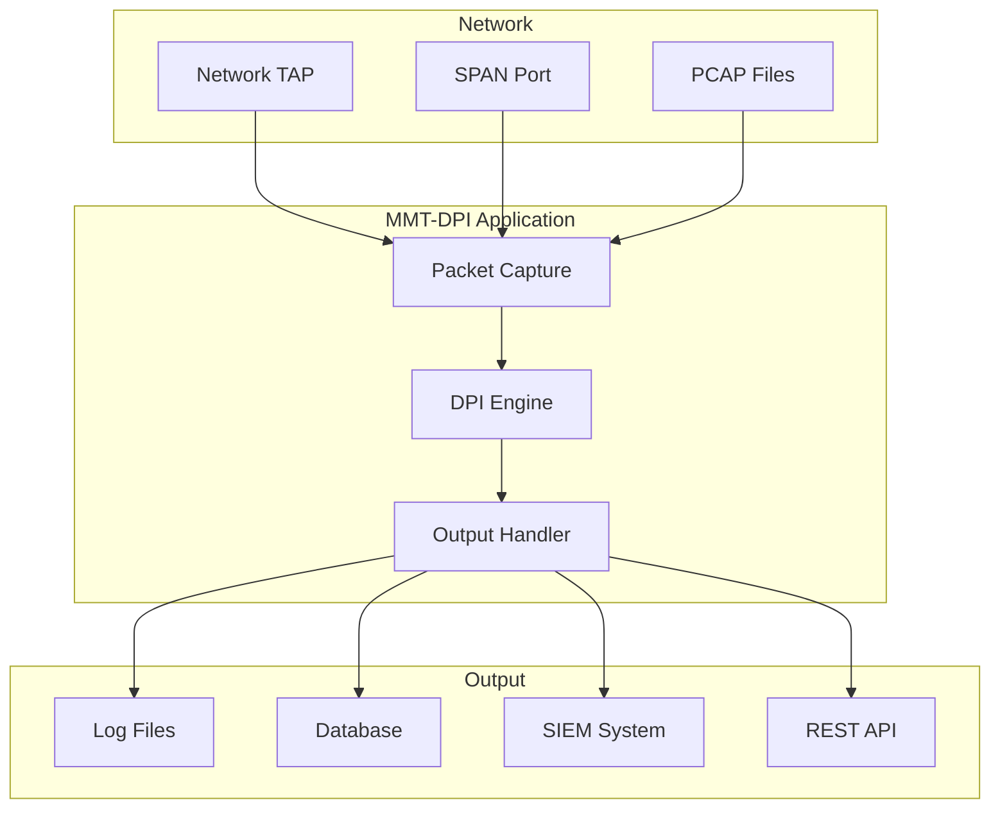

# Deployment Guide

Production deployment considerations for MMT-DPI.

## Deployment Architecture



## System Requirements

### Hardware

| Metric | Minimum | Recommended |
|--------|---------|-------------|
| CPU | 4 cores | 8+ cores |
| RAM | 4 GB | 16+ GB |
| Network | 1 Gbps | 10+ Gbps |
| Storage | SSD 100GB | SSD 500GB+ |

### Software

- Linux kernel 4.x+ (5.x recommended)
- libpcap 1.9+
- glibc 2.17+

## Installation

### System Installation

```bash
cd sdk
sudo make install
```

### Library Configuration

```bash
# Add library path
echo "/opt/mmt/dpi/lib" | sudo tee /etc/ld.so.conf.d/mmt-dpi.conf
sudo ldconfig
```

### Environment Variables

```bash
# Add to /etc/environment or application startup
export MMT_PLUGINS_PATH=/opt/mmt/plugins
export LD_LIBRARY_PATH=/opt/mmt/dpi/lib:$LD_LIBRARY_PATH
```

## Performance Tuning

### Kernel Parameters

```bash
# /etc/sysctl.conf
net.core.rmem_max = 134217728
net.core.rmem_default = 134217728
net.core.netdev_max_backlog = 250000
net.core.optmem_max = 134217728
```

Apply changes:
```bash
sudo sysctl -p
```

### CPU Affinity

Pin packet capture to specific CPUs:

```c
#include <sched.h>

cpu_set_t cpuset;
CPU_ZERO(&cpuset);
CPU_SET(0, &cpuset);  // CPU 0
CPU_SET(1, &cpuset);  // CPU 1
sched_setaffinity(0, sizeof(cpuset), &cpuset);
```

### NUMA Awareness

For multi-socket systems:

```bash
# Run on specific NUMA node
numactl --cpunodebind=0 --membind=0 ./my_mmt_app
```

### Packet Capture Optimization

```c
// Increase buffer size
char errbuf[PCAP_ERRBUF_SIZE];
pcap_t *pcap = pcap_open_live(interface, 65535, 1, 10, errbuf);

// Set buffer size (128 MB)
pcap_set_buffer_size(pcap, 128 * 1024 * 1024);
```

## Multi-Threading

### Per-Thread Handler Pattern

```c
#include <pthread.h>

typedef struct {
    int thread_id;
    const char *interface;
} thread_args_t;

void *packet_thread(void *arg)
{
    thread_args_t *args = (thread_args_t *)arg;

    // Each thread gets its own handler
    mmt_handler_t *handler = mmt_init_handler(DLT_EN10MB, 0, NULL);

    // Open capture
    pcap_t *pcap = pcap_open_live(args->interface, 65535, 1, 10, NULL);

    // Process packets
    struct pcap_pkthdr *header;
    const u_char *data;

    while (pcap_next_ex(pcap, &header, &data) >= 0) {
        struct pkthdr hdr = {
            .ts = header->ts,
            .caplen = header->caplen,
            .len = header->len
        };
        mmt_process_packet(handler, &hdr, data);
    }

    mmt_close_handler(handler);
    pcap_close(pcap);

    return NULL;
}

int main(void)
{
    init_proto_tcpip_struct();

    pthread_t threads[4];
    thread_args_t args[4];

    for (int i = 0; i < 4; i++) {
        args[i].thread_id = i;
        args[i].interface = "eth0";
        pthread_create(&threads[i], NULL, packet_thread, &args[i]);
    }

    for (int i = 0; i < 4; i++) {
        pthread_join(threads[i], NULL);
    }

    return 0;
}
```

## Session Timeout Configuration

```c
// Configure session timeouts (in seconds)
#define SESSION_TIMEOUT_TCP    300   // 5 minutes
#define SESSION_TIMEOUT_UDP    60    // 1 minute
#define SESSION_TIMEOUT_OTHER  30    // 30 seconds

// Periodic session cleanup
void cleanup_sessions(mmt_handler_t *handler)
{
    mmt_cleanup_expired_sessions(handler, SESSION_TIMEOUT_TCP);
}
```

## Logging in Production

### Configure Log Level

```c
#include "mmt_logging.h"

// Production: INFO level
mmt_log_init();
mmt_log_set_level(MMT_LOG_INFO);

// Log to file
FILE *logfile = fopen("/var/log/mmt-dpi/mmt.log", "a");
mmt_log_set_output(logfile);
```

### Log Rotation

Use logrotate:

```
# /etc/logrotate.d/mmt-dpi
/var/log/mmt-dpi/*.log {
    daily
    rotate 7
    compress
    delaycompress
    missingok
    notifempty
    create 0640 root root
}
```

## Monitoring

### Health Check Endpoint

```c
#include <sys/socket.h>

void *health_check_thread(void *arg)
{
    int sock = socket(AF_INET, SOCK_STREAM, 0);
    // Bind to port 8080
    // Accept connections
    // Return "OK" if processing
    // Return "ERROR" if issues
    return NULL;
}
```

### Metrics Collection

```c
typedef struct {
    uint64_t packets_processed;
    uint64_t packets_failed;
    uint64_t bytes_processed;
    uint64_t active_sessions;
} mmt_metrics_t;

// Atomic updates
__atomic_add_fetch(&metrics.packets_processed, 1, __ATOMIC_RELAXED);
```

## Security Considerations

### Privilege Separation

```c
// Capture with root, then drop privileges
pcap_t *pcap = pcap_open_live(...);

// Drop to unprivileged user
setgid(nobody_gid);
setuid(nobody_uid);
```

### Capabilities (Linux)

Instead of running as root:

```bash
# Set capabilities on binary
sudo setcap cap_net_raw,cap_net_admin=eip ./my_mmt_app
```

### Seccomp Filtering

Restrict system calls:

```c
#include <seccomp.h>

scmp_filter_ctx ctx = seccomp_init(SCMP_ACT_KILL);
seccomp_rule_add(ctx, SCMP_ACT_ALLOW, SCMP_SYS(read), 0);
seccomp_rule_add(ctx, SCMP_ACT_ALLOW, SCMP_SYS(write), 0);
// Add allowed syscalls
seccomp_load(ctx);
```

## Containerization

### Docker Deployment

```dockerfile
FROM ubuntu:22.04

RUN apt-get update && apt-get install -y \
    libpcap0.8 \
    libxml2

COPY sdk/lib/* /opt/mmt/dpi/lib/
COPY sdk/include/* /opt/mmt/dpi/include/
COPY my_app /opt/mmt/bin/

ENV LD_LIBRARY_PATH=/opt/mmt/dpi/lib
ENV MMT_PLUGINS_PATH=/opt/mmt/plugins

ENTRYPOINT ["/opt/mmt/bin/my_app"]
```

### Docker Compose

```yaml
version: '3'
services:
  mmt-dpi:
    build: .
    network_mode: host
    cap_add:
      - NET_RAW
      - NET_ADMIN
    volumes:
      - /var/log/mmt:/var/log/mmt
```

## Systemd Service

```ini
# /etc/systemd/system/mmt-dpi.service
[Unit]
Description=MMT-DPI Network Analysis
After=network.target

[Service]
Type=simple
ExecStart=/opt/mmt/bin/my_mmt_app -i eth0
Restart=always
RestartSec=5
User=mmt
Group=mmt
AmbientCapabilities=CAP_NET_RAW CAP_NET_ADMIN

[Install]
WantedBy=multi-user.target
```

Enable and start:

```bash
sudo systemctl enable mmt-dpi
sudo systemctl start mmt-dpi
```

## Troubleshooting Production Issues

### High CPU Usage

1. Check packet rate: `iftop -i eth0`
2. Enable debug logging temporarily
3. Profile with `perf top`

### Memory Growth

1. Monitor with `top` or `htop`
2. Check session count
3. Verify session cleanup is running
4. Run with Valgrind in test environment

### Packet Loss

1. Check `netstat -su` for drops
2. Increase kernel buffer: `net.core.rmem_max`
3. Increase pcap buffer size
4. Add more processing threads

## See Also

- [Installation Guide](installation.md)
- [Troubleshooting](../troubleshooting/README.md)
- [Architecture Overview](../architecture/README.md)
