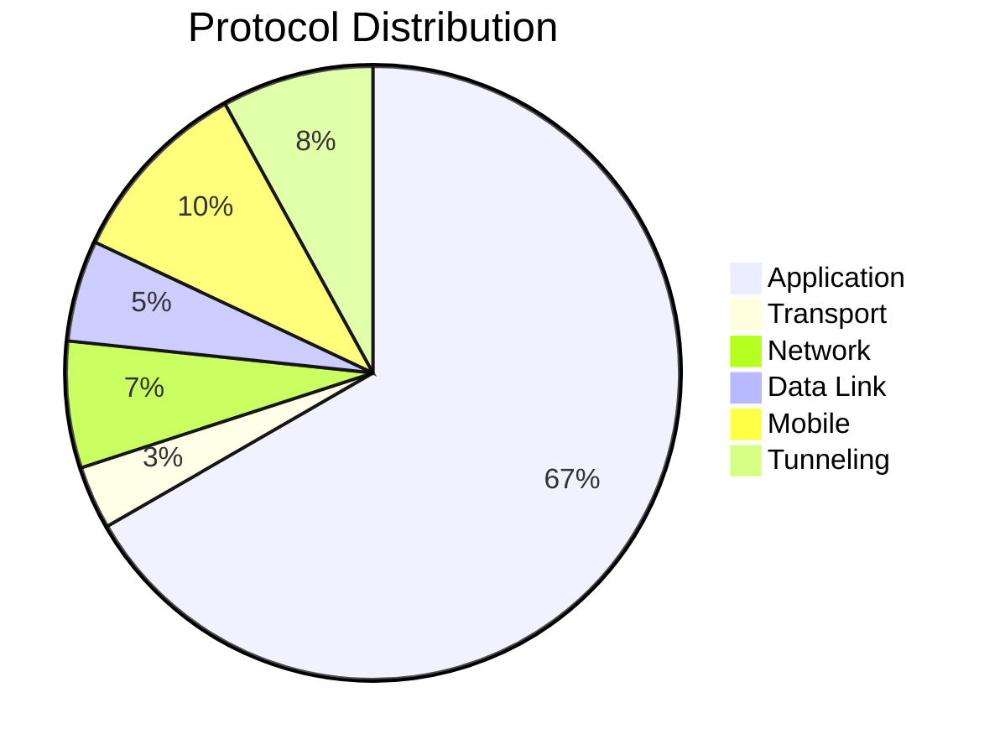
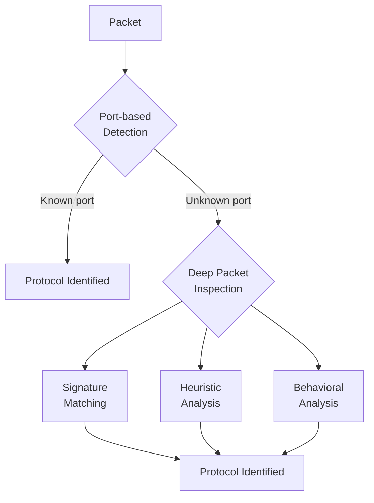

# Protocol Documentation

MMT-DPI supports 200+ protocols organized by category.

## Protocol Categories



## Protocol Index

### Layer 2 - Data Link

| Protocol | ID | Description |
|----------|-------|-------------|
| Ethernet | 1 | IEEE 802.3 Ethernet |
| VLAN | 2 | 802.1Q VLAN tagging |
| PPP | 3 | Point-to-Point Protocol |
| LLC | 4 | Logical Link Control |
| BATMAN | 5 | Better Approach To Mobile Ad-hoc Networking |
| MPLS | 6 | Multi-Protocol Label Switching |

### Layer 3 - Network

| Protocol | ID | Description |
|----------|-------|-------------|
| IPv4 | 10 | Internet Protocol version 4 |
| IPv6 | 11 | Internet Protocol version 6 |
| ICMP | 12 | Internet Control Message Protocol |
| ICMPv6 | 13 | ICMP for IPv6 |
| ARP | 14 | Address Resolution Protocol |
| GRE | 15 | Generic Routing Encapsulation |

### Layer 4 - Transport

| Protocol | ID | Description |
|----------|-------|-------------|
| TCP | 6 | Transmission Control Protocol |
| UDP | 17 | User Datagram Protocol |
| SCTP | 132 | Stream Control Transmission Protocol |

### Layer 7 - Application (Web)

| Protocol | ID | Description |
|----------|-------|-------------|
| HTTP | 80 | Hypertext Transfer Protocol |
| HTTP/2 | 81 | HTTP version 2 |
| HTTPS | 443 | HTTP over TLS |
| QUIC | 82 | Quick UDP Internet Connections |

### Layer 7 - Application (Email)

| Protocol | ID | Description |
|----------|-------|-------------|
| SMTP | 25 | Simple Mail Transfer Protocol |
| POP3 | 110 | Post Office Protocol 3 |
| IMAP | 143 | Internet Message Access Protocol |

### Layer 7 - Application (File Transfer)

| Protocol | ID | Description |
|----------|-------|-------------|
| FTP | 21 | File Transfer Protocol |
| TFTP | 69 | Trivial File Transfer Protocol |
| NFS | 2049 | Network File System |

### Layer 7 - Application (Name Services)

| Protocol | ID | Description |
|----------|-------|-------------|
| DNS | 53 | Domain Name System |
| mDNS | 5353 | Multicast DNS |
| LLMNR | 5355 | Link-Local Multicast Name Resolution |
| NetBIOS | 137 | NetBIOS Name Service |

### Layer 7 - Application (Remote Access)

| Protocol | ID | Description |
|----------|-------|-------------|
| SSH | 22 | Secure Shell |
| Telnet | 23 | Telnet Protocol |
| RDP | 3389 | Remote Desktop Protocol |
| VNC | 5900 | Virtual Network Computing |

### Layer 7 - Application (Security)

| Protocol | ID | Description |
|----------|-------|-------------|
| SSL/TLS | 443 | Secure Sockets Layer / Transport Layer Security |
| Kerberos | 88 | Kerberos Authentication |
| LDAP | 389 | Lightweight Directory Access Protocol |
| Radius | 1812 | Remote Authentication Dial-In User Service |

### Layer 7 - Application (Streaming)

| Protocol | ID | Description |
|----------|-------|-------------|
| RTP | 5004 | Real-time Transport Protocol |
| RTCP | 5005 | RTP Control Protocol |
| RTSP | 554 | Real Time Streaming Protocol |
| SIP | 5060 | Session Initiation Protocol |

### Mobile Protocols

| Protocol | ID | Description |
|----------|-------|-------------|
| GTP-U | 2152 | GPRS Tunneling Protocol - User Plane |
| GTP-C | 2123 | GPRS Tunneling Protocol - Control Plane |
| Diameter | 3868 | Diameter Signaling |
| S1AP | - | S1 Application Protocol (LTE) |
| NGAP | - | NG Application Protocol (5G) |
| NAS | - | Non-Access Stratum |

### Tunneling Protocols

| Protocol | ID | Description |
|----------|-------|-------------|
| GRE | 47 | Generic Routing Encapsulation |
| VXLAN | 4789 | Virtual Extensible LAN |
| IPsec | 500 | IP Security |
| L2TP | 1701 | Layer 2 Tunneling Protocol |
| Teredo | 3544 | IPv6 over UDP |

## Protocol Attributes

Each protocol exposes specific attributes for extraction. Example for TCP:

| Attribute | ID | Type | Description |
|-----------|-------|------|-------------|
| SRC_PORT | 1 | U16 | Source port |
| DST_PORT | 2 | U16 | Destination port |
| SEQ_NUM | 3 | U32 | Sequence number |
| ACK_NUM | 4 | U32 | Acknowledgment number |
| FLAGS | 5 | U8 | TCP flags (SYN, ACK, FIN, etc.) |
| WINDOW | 6 | U16 | Window size |

## Extracting Protocol Attributes

```c
#include "mmt_core.h"
#include "tcpip/mmt_tcpip.h"

void http_callback(const ipacket_t *packet,
                   attribute_t *attribute,
                   void *user_data) {
    if (attribute->data) {
        printf("HTTP Host: %s\n", (char*)attribute->data);
    }
}

int main(void) {
    mmt_handler_t *handler = mmt_init_handler(DLT_EN10MB, 0, NULL);
    init_proto_tcpip_struct();

    // Register for HTTP Host attribute
    mmt_register_extraction_attribute(handler,
        PROTO_HTTP,          // Protocol ID
        HTTP_HOST,           // Attribute ID
        http_callback,       // Callback
        NULL);               // User data

    // Process packets...

    mmt_close_handler(handler);
    return 0;
}
```

## Protocol Detection Methods

MMT-DPI uses multiple detection methods:



### Port-Based Detection

Fast identification using well-known ports:
- Port 80 → HTTP
- Port 443 → HTTPS
- Port 53 → DNS

### Signature Matching

Pattern matching in packet payload:
- HTTP: `GET `, `POST `, `HTTP/1.`
- SSH: `SSH-2.0`
- TLS: Client Hello signature

### Heuristic Analysis

Statistical analysis of traffic patterns for encrypted protocols.

## Detailed Protocol Documentation

For detailed information about specific protocols, see:

- [TCP/IP Protocols](tcp-ip/) - Core Internet protocols
- [Mobile Protocols](mobile/) - GTP, S1AP, NGAP, NAS
- [Application Protocols](../../docs/) - Application-layer protocols

## Adding Custom Protocols

See [Adding Protocols Guide](../guides/adding-protocols.md) for instructions on implementing new protocol handlers.
